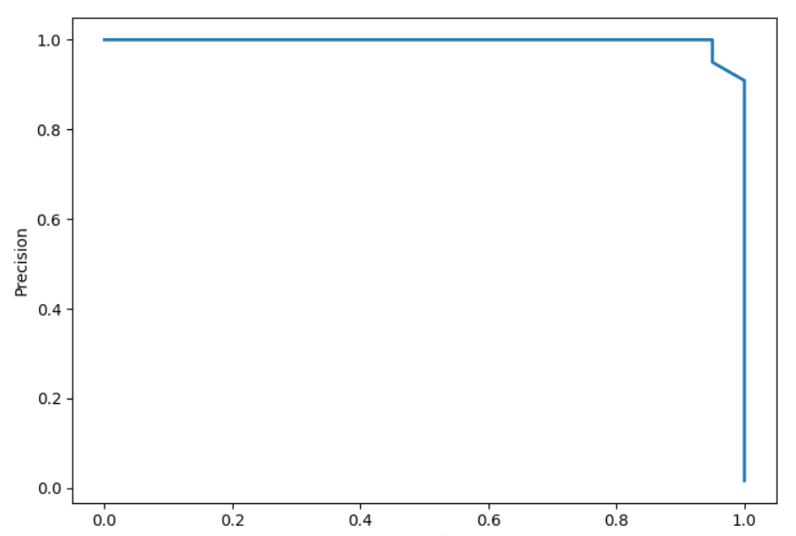
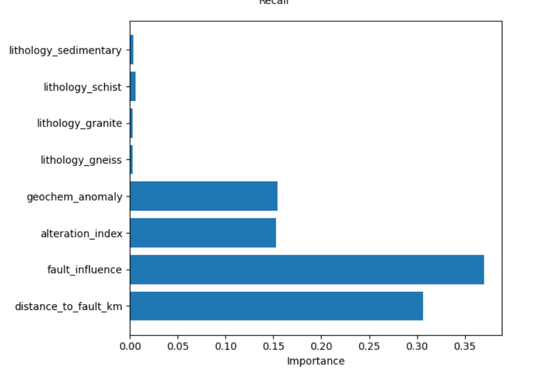
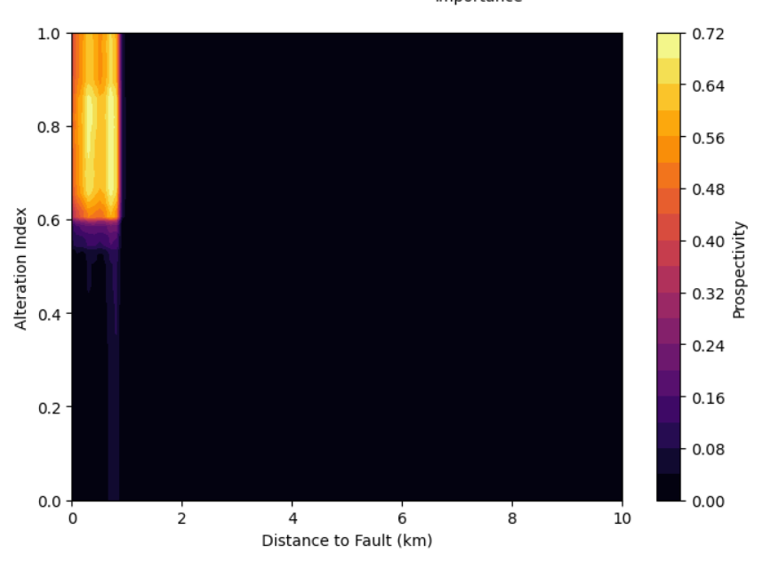

# ⛏️ Mineral Prospectivity Mapping using GeoAI

Machine Learning • Economic Geology • Mineral Exploration • GeoAI

---

## 📌 Project Overview

Mineral deposits rarely occur randomly. Their formation is strongly controlled by geological structures, hydrothermal alteration, host rock composition, and geochemical anomalies.

This project demonstrates how **machine learning can support geological interpretation** by identifying areas that may have higher mineral prospectivity. The goal is not to claim mineral discovery, but to illustrate how geological indicators can be integrated into a simple data-driven workflow.

The project combines geological reasoning with a **Random Forest classification model** to simulate an early-stage mineral exploration analysis.

---

## 🎯 Project Objectives

- Demonstrate how geological indicators influence mineral prospectivity  
- Apply machine learning to rank areas based on geological favorability  
- Visualize potential mineral zones using a prospectivity heatmap  
- Evaluate model behavior using feature importance and precision–recall analysis  

---

## 🪨 Geological Indicators Used

The model incorporates several geological proxies commonly considered during mineral exploration:

- **Distance to Fault (km)**  
  Structural controls strongly influence hydrothermal fluid flow.

- **Fault Influence Factor**  
  Represents the decay of structural influence away from major faults.

- **Alteration Index**  
  Indicates hydrothermal alteration intensity.

- **Geochemical Anomaly Strength**  
  Represents enrichment of mineral-related elements.

- **Lithology (Host Rock Type)**  
  Different rock types have different mineralization potential.

These variables were selected for **geological meaning rather than mathematical convenience**.

---

## 🧠 Modeling Approach

A **Random Forest classifier** was used to estimate mineral prospectivity.

Key aspects of the modeling workflow include:

- Generation of a synthetic geological dataset
- Encoding lithological categories
- Handling class imbalance using balanced class weighting
- Model validation using **Stratified K-Fold Cross-Validation**
- Evaluation using **Precision–Recall analysis**, which is more suitable for rare-event problems such as mineral discovery

---

## 📊 Model Evaluation

The model performance was evaluated using a **Precision–Recall Curve**, which measures how effectively the model identifies mineralized zones while minimizing false positives.

---

## 📈 Feature Importance Analysis

Feature importance analysis highlights which geological indicators most strongly influence the model's predictions.

---

## 🗺️ Mineral Prospectivity Map

A prospectivity heatmap was generated to visualize how mineral potential varies with structural proximity and alteration intensity.

Bright regions represent areas where geological conditions are more favorable for mineralization under the modeled scenario.

---

## ⚠️ Important Note

This project **does not claim mineral discovery**.  
It is intended purely as an **academic demonstration** of how machine learning can support geological interpretation during early exploration stages.

Real mineral exploration requires integration of:

- Field mapping
- Geophysical surveys
- Geochemical sampling
- Drilling data
- Expert geological interpretation

---

## 🚀 Future Scope

This workflow could be expanded using real geological datasets by incorporating:

- Fault and structural GIS layers  
- Remote sensing alteration indices  
- Multi-element geochemical surveys  
- Spatial validation techniques  
- Integration with GIS-based mineral systems modeling  

---

## 🛠 Tools & Technologies

- Python  
- NumPy  
- Pandas  
- Scikit-Learn  
- Matplotlib  

---

## 📚 References

1. Bonham-Carter, G. F. (1994). *Geographic Information Systems for Geoscientists*.  
2. Carranza, E. J. M. (2009). *Geochemical Anomaly and Mineral Prospectivity Mapping*.  
3. Kuhn, M. & Johnson, K. (2013). *Applied Predictive Modeling*.  
4. Breiman, L. (2001). Random Forests. *Machine Learning Journal*.

---

## 👤 Author

**Bikrant Kumar Mishra**  
B.Sc. Geology  

Interests:  
GeoAI • Mineral Exploration • Machine Learning • Earth System Analysis
